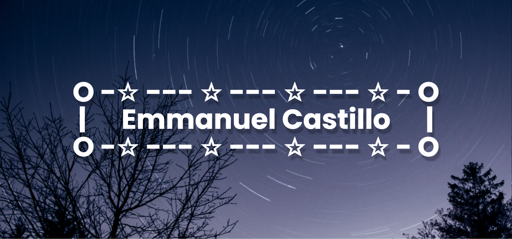

# All About Me:

## Name: Emmanuel Castillo Hernandez
I'm just a Californian looking to enjoy life to its fullest extent while also trying to raise awareness about social and environmental issues that affect our daily lives.

## Personal Info:

### Age: 16
### Nationality: Mexican
### Languages Fluent In: English and Spanish
### Sexuality: Bisexual 
### Pronouns: `Any Pronouns`
### Interests:
* Gardening
* Drawing
* Listening to Music From:
*  * Gotye
*  * Coldplay
*  * Maroon 5
*  * Doja Cat
*  * Zoé
*  * Mon Laferte
* Engaging in Political Discourse
* Exploring new places
* Playing video games (COD Black Ops III, Minecraft, Mortal Combat X)
* Cooking
* Stargazing
* Programming

## Projects:
### Comet

Comet is a Discord Bot built on originally Discord.py, but now it uses PyCord. This bot has many cool features like a 5-page snipe, edit snipe, a music player with Spotify support (sort-of), a flexible warning system, and image commands capable of taking user images as input and generating images based on them.

#### CometCRISIS (WIP)
Comet will soon have a pseudo-hotline called CometCRISIS, where a user can get resources they need to deal with stressful situations like being having ICE at your front door to even giving resources for suicide prevention. Users are allowed the option to use CometCRISIS in English or Spanish and can even contact the bot's developer (me) in case that they need help from a person. It is still in development, but progress on CometCRISIS is going well, with it being 55% complete.

I expect the hotline to be fully functional by Dec. 2021 and serve the LA County in California, but CometCRISIS still tries to give the users out of the LA County Area useful information.

#### Check Out Comet
To check out Comet, go to its **[GitHub Page](https://github.com/EmmanuelCastilloHernandez/CometBot)** and to invite it visit its **[Official Website](https://cometbot.emmanuelch.repl.co/)**

## Contacts:
### Discord: eta_c4rinae#7810
### Email: emmanuelino2@gmail.com
